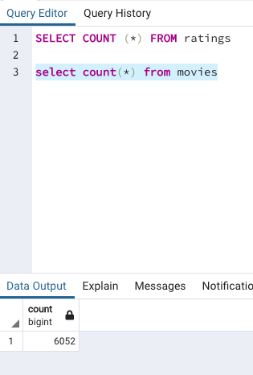
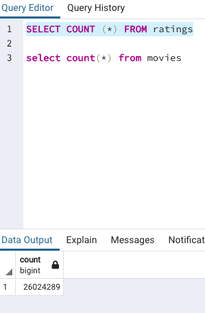

# Movies-ETL
**Challenge 8**

## Overview ##
The purpose of this challenge and module is to help Amazing Prime maintain an updated database for storing accurate information on movies with ratings. 

The challenge refactors the existing code into a streamlined function where we can input the three files, and output the data into the database

## Results ##
After successfully refactoring the code, we have the following Postgres tables:

</img>

</img>
